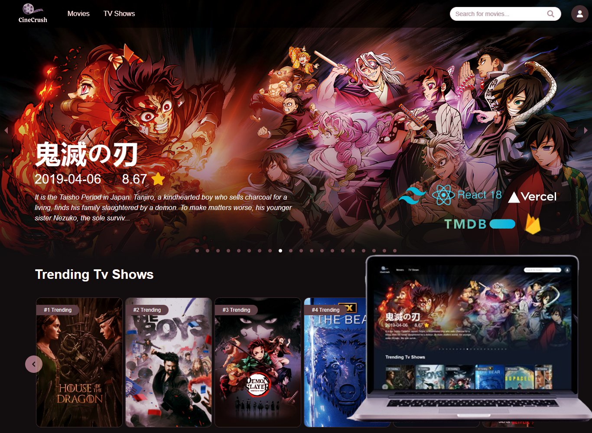
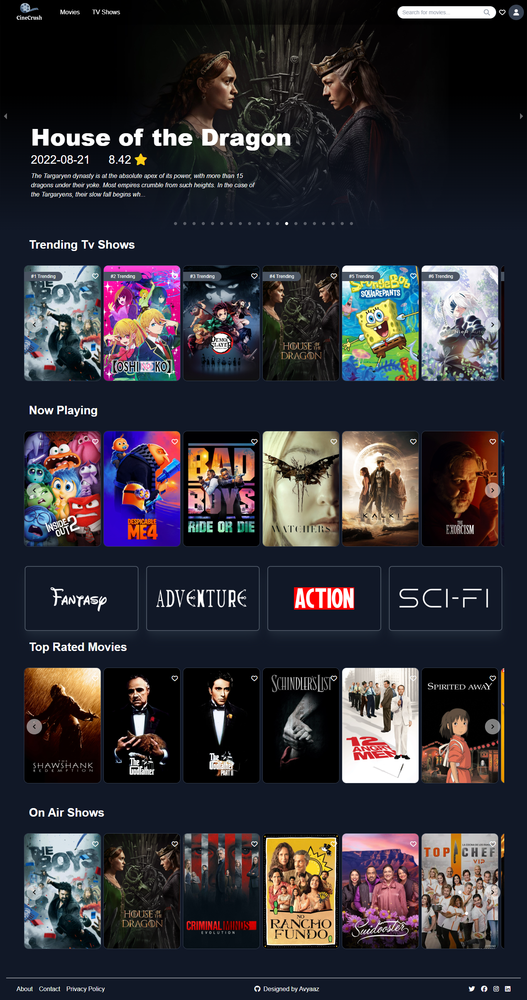
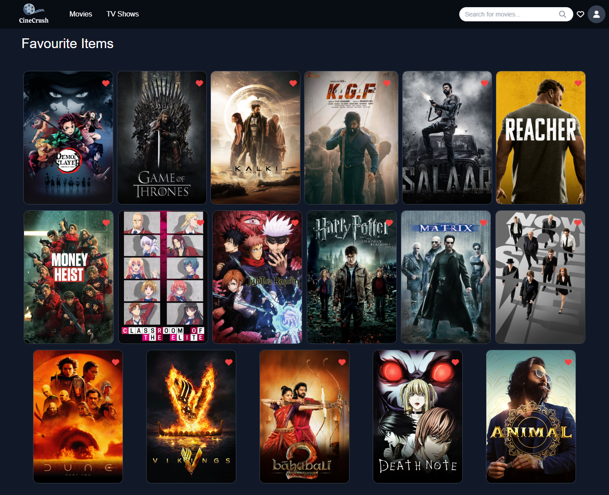

# 🎬 Movie Mania Web Application🍿

Welcome to Movie Mania, your ultimate destination for all movies! This project is built using React, Tailwind CSS, and integrates with the TMDb API for fetching movie data.



## ✨Features

- Browse top-rated movies and TV shows.
- Search for movies and TV shows by title.
- View detailed information about each movie or TV show, including synopsis, cast, and trailers.
- Google authentication using Firebase for user sign-in.
- Watch trailers directly from YouTube for selected movies.
- Save your favorite movies and TV shows to easily access them later.
- Rate movies and TV shows.
- [Quick tour](<](https://github.com/Avyaaz18/Movie-Mania/blob/main/src/assets/Videos/MovieMania.mp4)>) of the website available in the About section.

<!-- ## 🖼️Screenshots

### 🏠Home Page

 -->

### 🎥Favourite Shows Page



## 🛠️Technologies Used

- React
- Tailwind CSS
- TMDb API
- Firebase Authentication
- Firestore Database

## 🚀Getting Started

To run this project locally, follow these steps:

1. Clone the repository.
2. Install dependencies using `npm install`.
3. Generate API keys for Firebase and TMDb.

   - Create a Firebase project and generate Firebase Web API keys.
   - Sign up for a TMDb API key and store it in your `.env` file.

   ```plaintext
   VITE_FIREBASE_API_KEY=your_firebase_api_key
   VITE_FIREBASE_AUTH_DOMAIN=your_firebase_auth_domain
   VITE_FIREBASE_PROJECT_ID=your_firebase_project_id
   VITE_FIREBASE_STORAGE_BUCKET=your_firebase_storage_bucket
   VITE_FIREBASE_MESSAGING_SENDER_ID=your_firebase_messaging_sender_id
   VITE_FIREBASE_APP_ID=your_firebase_app_id
   VITE_FIREBASE_MEASUREMENT_ID=your_firebase_measurement_id

   VITE_TMDB_API_KEY=your_tmdb_api_key
   ```

4. Start the development server with `npm run dev`.

## 🌐Deployment

This project is deployed on Vercel. You can view it live at [Movie Mania](https://movie-mania-ashy.vercel.app/).

To deploy your own instance, follow these steps:

1. Configure your Vercel account and project settings.
2. Set up environment variables for API keys or other sensitive information.
3. Deploy your project using Vercel's CLI or GitHub integration.

## 🔮Future Enhancements

- Implement user reviews for movies.
- Enhance search functionality with autocomplete suggestions.

## Acknowledgments

- [Flowbite](https://flowbite.com/docs/getting-started/introduction/)
- [TMDB](https://www.themoviedb.org/) for providing the API.
